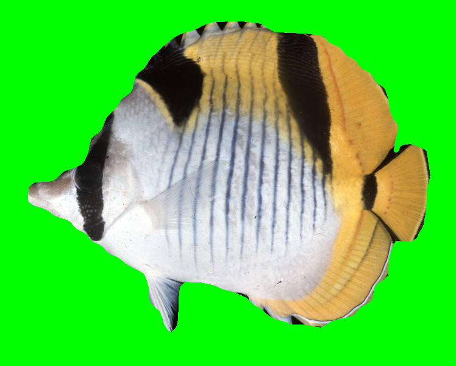
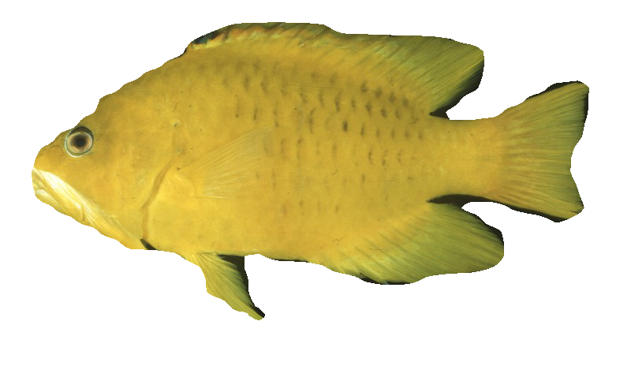

# sashimi: Automatic high-throughput pipeline for organismal image segmentation using deep learning

We present a software module written in *Python* (Version 3.6.5) that is accessible by cloning the GitHub repository [https://github.com/ShawnTylerSchwartz/sashimi](https://github.com/ShawnTylerSchwartz/sashimi). Training and inspiration based on Matterport's open-source Keras and TensorFlow implementation of Mask R-CNN [https://github.com/matterport/Mask_RCNN](https://github.com/matterport/Mask_RCNN).

*To view the __sashimi__ web-interface, please visit: [https://github.com/ShawnTylerSchwartz/sashimi-web-interface](https://github.com/ShawnTylerSchwartz/sashimi-web-interface).*

*To view the __fish segmentation analyses_ files, please visit: [https://github.com/ShawnTylerSchwartz/fish-segmentation-analyses](https://github.com/ShawnTylerSchwartz/fish-segmentation-analyses).*

To get started, clone the repository:
```
$ git clone https://github.com/ShawnTylerSchwartz/sashimi.git
```

Specific installation instructions and requirements, as well as instructions to execute our module, are outlined in our GitHub repository’s [requirements.txt](requirements.txt) file. At this release, users should ensure that they have **Python (Version > 3.4)** installed on their system.

## Requirements
Users should have the following requirements installed:
```
// Available in 'requirements.txt'
numpy==1.18.0
scipy==1.4.1
Pillow==6.2.1
Cython==0.29.14
matplotlib==3.1.2
scikit-image==0.16.2
tensorflow==1.4.0
keras==2.1.5
opencv-python==4.1.2.30
h5py==2.10.0
imgaug==0.3.0
IPython[all]
```

We highly recommend using a virtual environment to run this program. Here is an example:
```
# Install virtualenv if not already installed
$ pip install virtualenv
```
```
# Create an environment
# (you can create this file in an "envs" directory in your development directory)
$ virtualenv sashimi_env
```
```
# Activate the environment
$ source pathtoenvs/sashimi_env/bin/activate
```
```
# Install necessary requirements
$ pip install -r requirements.txt
```
```
# Deactivate environment when no longer using the sashimi program
$ deactivate
```

## Running the sashimi pipeline
Users can specify the input directory of organismal images via the *--input* flag (input requirement: a local directory in which JPEG, JPG, or PNG images of fish containing their background pixels are stored). The desired output directory can be specified via the *--output* flag when executing the *Python* script from the command line interpreter (if the specified output directory does not exist, the program will first create the directory as specified by the user before performing the automated background removal procedure).

It is recommended to place the input directory of images inside the cloned sashimi repository on your machine.

Here is a default call of the pipeline:
```
$ python3 sashimi.py --input=fish_images --output=fish_images_output
```

There are a variety of arguments that can be specified for more custom use cases beyond coral reef fishes. Below is a table of the various arguments and options:
| Argument      | Expected Input | Description | Required/Optional |
| ----------- | ----------- | ----------- | ----------- |
| *--input, -i*      | *path/to/input*       | Directory of images to remove backgrounds from.      | *Required*       |
| *--output, -o*   | *path/for/output*        | Directory to save background-removed images in.      | *Required*       |
| *--red, -r*   | Floating point value (from 0 to 1).        | (R)ed intensity values (from 0 to 1) for background-mask color. Defaults to alpha layer.      | *Optional*       |
| *--green, -g*   | Floating point value (from 0 to 1).        | (G)reen intensity values (from 0 to 1) for background-mask color. Defaults to alpha layer.      | *Optional*       |
| *--blue, -b*   | Floating point value (from 0 to 1).        | (B)lue intensity values (from 0 to 1) for background-mask color. (Note: program will scale these values to an integer value between 0 and 255.) Defaults to alpha layer.      | *Optional*       |
| *--segmentation, -z*   | Boolean value (0 or 1).        | Set to 0 (false) to skip image segmentation step (if images are already segmented – either manually or from a previous sashimi run) to perform filling background pixels of previously segmented images (note: must be of *“.png”* file format) with desired background-mask color (RGB) values. Defaults to perform segmentation.      | *Optional*       |
| *--model, -m*   | *path/to/trained/model*        | Path to custom trained model (with .h5 extension). Defaults to built-in demo fish segmentation model.      | *Optional*       |

## Examples
Below are example calls to the command line for various examples:

*Color background pixels of previously segmented .png file green*
```
$ python3 sashimi.py --input=fish_images --output=fish_images_output --segmentation=0 --red=0.0 --green=1.0 --blue=0.0
```
**Example of output image from previously specified directory:**


(_Chaetodon falcula_)

---

*Color background pixels of previously segmented .png file blue*
```
$ python3 sashimi.py --input=bird_images --output=bird_images_output --segmentation=0 --red=0.0 --green=0.0 --blue=1.0
```
**Example of output image from previously specified directory:**


(_Tangara abbas_)

*Segment images of taxonomic group with custom model*
```
$ python3 sashimi.py --input=fish_images --output=fish_images_output --model=path/to/custom/model.h5
```
**Example of output image from previously specified directory:**


(_Epibulus insidiator_)

## Training a new model
1. Download COCO weights here: [https://github.com/ShawnTylerSchwartz/sashimi/releases/download/v1.0.0/mask_rcnn_coco.h5](https://github.com/ShawnTylerSchwartz/sashimi/releases/download/v1.0.0/mask_rcnn_coco.h5)
2. Have training data set ready (`train/` and `val/` directories within the `sashimi` Python module directory, each containing the train/val images and `.json` files with training set coordinates generated via instructions on the _sashimi web-interface_, respectively)
3. Run the `core.py` script within the `sashimi` Python module directory using the `train/`, `val/`, and _coco weights_ you downloaded in `Step 1`.
```
$ python3 core.py train --dataset=/path/to/dir/containing/both/train+val_dirs/ --model=/path/to/mask_rcnn_coco.h5
```