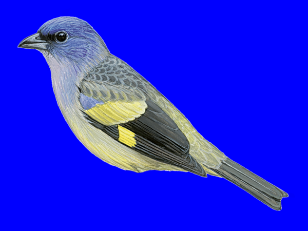
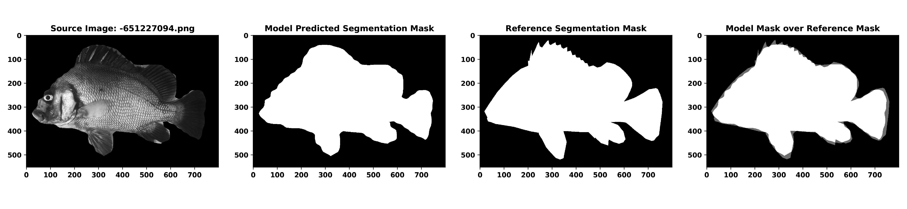
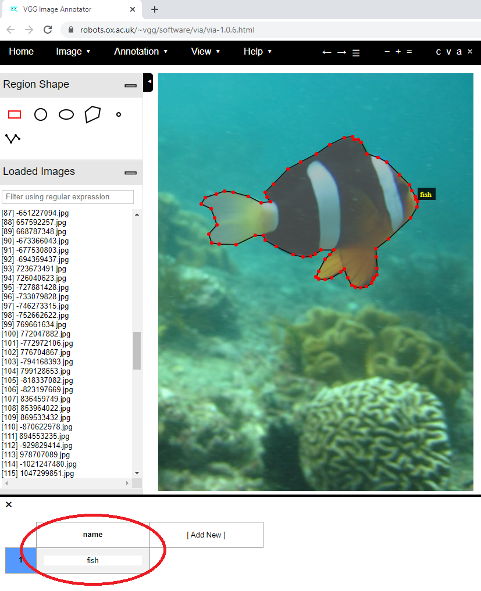

# *Sashimi*: A toolkit for facilitating high-throughput organismal image segmentation using deep learning

Shawn T. Schwartz* and Michael E. Alfaro

Department of Ecology and Evolutionary Biology, University of California, Los Angeles

*Correspondence concerning this article should be addressed to Shawn Schwartz, Terasaki Life Sciences Building 2153, University of California, Los Angeles, CA 90095, USA. Email: shawnschwartz@ucla.edu

__*APPLICATION PAPER UNDER REVIEW*__

## Abstract
1. One crucial image preprocessing step in any image analysis workflow is image segmentation, or the ability to clearly contrast the foreground target from the background noise in an image. This procedure is typically done manually, creating a potential bottleneck for efforts to quantify biodiversity from image databases. Advances in image segmentation meta-algorithms for deep learning provide an opportunity to relax this bottleneck, though the most accessible pre-trained convolutional neural networks have been trained on a small fraction of biodiversity, severely limiting their utility.


2. We trained a deep learning model to automatically segment target fish from images with both standardized and complex, noisy backgrounds. We then assessed the performance of our deep learning model using qualitative visual inspection and quantitative image segmentation metrics of pixel overlap between reference segmentation masks generated manually by experts and those automatically predicted by our model.


3. Visual inspection revealed that our model segmented fishes with high precision and relatively few artifacts. These results suggest that the meta-algorithm (Mask R-CNN), in which our current fish segmentation model relies on, is well-suited for generating high-fidelity segmented specimen images across a variety of background contexts at rapid pace.


4. We present _Sashimi_, an easy-to-use command line toolkit to facilitate rapid, automated high-throughput image segmentation of digitized organisms. _Sashimi_ is accessible to non-programmers and does not require experience with deep learning to use. The flexibility of Mask R-CNN allows users to easily generate a segmentation model for use on diverse animal and plant images given relatively modest training datasets. To help grow the taxonomic scope of images that can be recognized, _Sashimi_ also includes a central database for sharing and distributing custom-trained segmentation models of other unrepresented organisms. Lastly, _Sashimi_ includes both auxiliary image preprocessing functions useful for some popular downstream color pattern analysis workflows, as well as a simple script to aid users in qualitatively and quantitatively assessing segmentation model performance for complementary sets of automatically and manually segmented images.


## Summary
We present a software module written in *Python* (Version 3.7.3) that is accessible by cloning the GitHub repository [https://github.com/ShawnTylerSchwartz/sashimi](https://github.com/ShawnTylerSchwartz/sashimi). Training and inspiration based on Matterport's open-source Keras and TensorFlow implementation of Mask R-CNN [https://github.com/matterport/Mask_RCNN](https://github.com/matterport/Mask_RCNN).

*To view the _Sashimi_ open-source organismal model sharing web-interface, please visit: [https://sashimi.shawntylerschwartz.com/](https://sashimi.shawntylerschwartz.com/).*

_Sashimi_ was built and tested on Python 3.7. Please consider using Docker to ensure proper compatibility; instructions for installing and using Docker are outlined below.

## Step 0: Install Docker (Skip if already installed)
Head over to [https://www.docker.com/products/docker-desktop](https://www.docker.com/products/docker-desktop) and install `Docker Desktop` on your OS.

Then, in your terminal, confirm Docker installed properly by typing in
```shell
$ docker -v
```
If it installed properly, you should see something like `Docker version 20.10.6, build 370c289` (though this may look slightly different depending on the exact version/build that was installed).

## Step 1: Clone the Repository
To get started, clone this repository to the desired location on your computer:
```bash
$ git clone https://github.com/ShawnTylerSchwartz/sashimi.git
```

## Step 2: Use Docker to Execute Sashimi
The following steps will outline the Docker run of _Sashimi_. See __Step 2: Create a Virtual Environment and Install Requirements__ if you'd like to skip using Docker and install dependencies manually (warning: will probably break if not using Python Version 3.7).

1. Head into your terminal and change directories in the _sashimi_ repository directory:
```shell
$ cd /path/to/sashimi
```


2. Then, build docker image:
```shell
$ docker build -t sashimi .
```


3. To execute Sashimi with default settings, run:
```shell
$ docker run sashimi -i "_examples/fish" -o "fish_outputs"
```
__NOTE:__ You can use any of the arguments outlined further along in this README within this docker run command line call; though, we are showing the docker run call with just the default `input` and `output` calls here for simplicity. See below for additional examples of standard python command line calls for _Sashimi_ that could be adapted to use within the docker command line call shown here.


4. Finally, extract segmented images from the latest Docker container run into the `_outputs/` directory located in your cloned `sashimi/` repository. We have created convenience scripts (`.cmd` for Windows; `.sh` for Mac/Linux) that will automatically extract the latest docker container id and copy the output files over into the `outputs/` directory in the _Sashimi_ repository directory automatically. See example command line calls below to execute:
4.1. *For Mac/Linux*
```shell
$ bash get_sashimi.sh
```

4.2. *For Windows:*
```shell
$ get_sashimi.cmd
```


---


## Step 2: Create a Virtual Environment and Install Requirements
We highly recommend using a virtual environment to run this program. Here is an example:
```bash
# Install virtualenv if not already installed
$ pip install virtualenv
```
```bash
# Create an environment
$ python -m venv sashimi_env
```
```bash
# Activate the environment
## On macOS and Linux:
$ source sashimi_env/bin/activate

## On Windows:
$ .\sashimi_env\Scripts\activate
```
```bash
# Install necessary requirements
## On macOS and Linux:
$ pip install -r requirements.txt

## On Windows
$ pip install -r requirements.windows.txt

```
```bash
# Deactivate environment when no longer using the sashimi program
$ deactivate
```

## Requirements
Users should have the following requirements installed:
```
// Available in 'requirements.txt' / 'requirements.windows.txt
numpy==1.16.4
scipy==1.2.1
Pillow==6.1.0
Cython==0.29.12
matplotlib==3.1.0
scikit-image==0.15.0
tensorflow==1.15.0
tensorflow-gpu==1.15.0
keras==2.2.5
opencv-python==4.1.1.26
h5py==2.9.0
ipython==7.6.1
imgaug==0.4.0
pycocotools==2.0 (use pycocotools-windows==2.0.0.2 instead for Windows)
```

## Step 3: Running the Sashimi pipeline
Users can specify the input directory of organismal images via the *--input* flag (input requirement: a local directory in which JPEG, JPG, or PNG images of fish containing their background pixels are stored). The desired output directory can be specified via the *--output* flag when executing the *Python* script from the command line interpreter (if the specified output directory does not exist, the program will first create the directory as specified by the user before performing the automated background removal procedure).

It is recommended to place the input directory of images inside the cloned _Sashimi_ repository on your machine.

There are a variety of arguments that can be specified for more custom use cases beyond coral reef fishes. Below is a table of the various arguments and options:
| Argument      | Expected Input | Description | Required/Optional |
| ----------- | ----------- | ----------- | ----------- |
| *--input, -i*      | *path/to/input*       | Directory of images to remove backgrounds from.      | *Required*       |
| *--output, -o*   | *path/for/output*        | Directory to save background-removed images in.      | *Required*       |
| *--red, -r*   | Floating point value (from 0 to 1).        | (R)ed intensity values (from 0 to 1) for background-mask color. Defaults to alpha layer.      | *Optional*       |
| *--green, -g*   | Floating point value (from 0 to 1).        | (G)reen intensity values (from 0 to 1) for background-mask color. Defaults to alpha layer.      | *Optional*       |
| *--blue, -b*   | Floating point value (from 0 to 1).        | (B)lue intensity values (from 0 to 1) for background-mask color. (Note: program will scale these values to an integer value between 0 and 255.) Defaults to alpha layer.      | *Optional*       |
| *--silhouette, -s* | Boolean value (0 or 1). | Set to 1 (true) to force segmented outputs to be filled in with black pixels (silhouette). | *Optional* |
| *--segmentation, -z*   | Boolean value (0 or 1).        | Set to 0 (false) to skip image segmentation step (if images are already segmented – either manually or from a previous sashimi run) to perform filling background pixels of previously segmented images (note: must be of *“.png”* file format) with desired background-mask color (RGB) values. Defaults to perform segmentation.      | *Optional*       |
| *--model, -m*   | */path/to/custom/model.h5*        | Path to custom segmentation model to use (defaults to models/fish_segmentation_model_schwartz_v1-0-0.h5)      | *Optional*       |
| *--organism, -n* | *name of class label to detect* | String with name of class label to detect, should match that used in training data. (Defaults to 'fish' for default fish segmentation model.) You can specify a label present in the COCO dataset to utilize the pre-trained weights in COCO. | *Optional* |
| *--regions, -y* | *Name of manual segmentation regions file.* | Should be placed in both train/ and val/ folders, and should have the same exact filename within each of those two folders. (Defaults to _fish-segmentation-regions.json) | *Optional* |
| *--imgsrc, -j* | *Where are source images located ('local' or 'url')* | Specify 'local' or 'url' depending on how paths are provided in your regions .JSON file. Important for distribution purposes. Default is URL -- images will be downloaded from source initially, and won't download again unless directory no longer exists. Use 'local' if images are stored directly in the respective train/ and val/ directories. | *Optional* |

Here is a default call of the pipeline (for fish images):
```shell
$ python sashimi.py --input=_examples/fish --output=fish_demo
```

The COCO dataset includes additional classes of animals already included in the model, including:
```
bird, cow, cat, dog, horse, mouse, sheep, zebra, giraffe
```

In order to segment images of one of these categories, simply specify the organism name matching the exact name from the above list to utilize the pre-trained weights already in COCO.
```shell
$ python sashimi.py --input=_examples/birds --output=birds_demo --organism=bird
```
_Note:_ The outputs of animal classes already included in COCO might not be of the same level of fidelity as the fish images included with _Sashimi_ out-of-the-box. Thus, additional training to refine edge boundaries might be required.

## Additional Examples
Below are example calls to the command line for various examples:

*Color background pixels of previously segmented .png file green*
```bash
$ python sashimi.py --input=_examples/fish --output=fish_demo --segmentation=0 --red=0.0 --green=1.0 --blue=0.0
```
**Example of output image from previously specified directory:**


(_Chaetodon falcula_)

---

*Color background pixels of previously segmented .png file blue*
```bash
$ python sashimi.py --input=bird_images --output=bird_images_output --segmentation=0 --red=0.0 --green=0.0 --blue=1.0
```
**Example of output image from previously specified directory:**


(_Tangara abbas_)

*Segment images of taxonomic group with custom model*
```bash
$ python sashimi.py --input=_examples/fish --output=fish_demo --model=path/to/custom/model.h5
```
**Example of output image from previously specified directory:**


(_Epibulus insidiator_)

## Evaluating Segmentations of Validation Images
You can use the command line tool we have constructed to evaluate ground truth (manual) reference segmentation masks for validation images with those automatically segmented by the model. 

### Instructions:
1. Please specify the automatically segmented image from _Sashimi_ that you would like to analyze (--image/-i).
2. Please specify the corresponding .JSON evaluation segmentation mask automatically generated for Sashimi for the specified image in (--evalmask/-e).

_Optional arguments:_
* Please specify the corresponding .JSON ground truth segmentation mask you manually created for the specified image (--gtmask/-gt).
* Please specify the directory you would like to output the evaluation data to if desired (--output/-o).

Below is an example input call and output evaluation csv file and visualization image for a fish in the validation image dataset.
```shell
$ python _tools/evaluate-segmentations.py --image=_outputs/segmented_fish/-651227094.png --evalmask=_logs/eval_mask_json_fish/-651227094.json --gtmask=sashimi/logs/gt_mask_json_fish/-651227094.json --output=my_evaluations
```

### Segmentation Evaluation Outputs
#### 1) CSV File of 4 Image Segmentation Evaluation Metrics
|source_image                          |eval_image_id                            |gt_image_id                                   |pixel_acc         |mean_acc          |mean_IU           |freq_weighted_IU  |
|--------------------------------------|-----------------------------------------|----------------------------------------------|------------------|------------------|------------------|------------------|
|_outputs/segmented_fish/-651227094.png|_logs/eval_mask_json_fish/-651227094.json|sashimi/logs/gt_mask_json_fish/-651227094.json|0.9707563405797102|0.9688295253210177|0.9424946076208486|0.9430852110936757|

#### 2) Visualization Image of Ground Truth Reference and Deep Learning Segmentation


## Training a New Model
1. Gather representive set of organism images and separate into `train/` and `val/` directories within `sashimi/sashimi/{organism_name_here}/`.
2. Head over to [https://www.robots.ox.ac.uk/~vgg/software/via/via-1.0.6.html](https://www.robots.ox.ac.uk/~vgg/software/via/via-1.0.6.html) and manually annotate each training and validation image. For region attributes, create a field called "name" and then, for every polygonal annotation mask you draw over your organism of interest, label that region a generic name of your organism (e.g., "monkey"). Repeat for every image within the train and validation image sets. See screen shot below:

3. Save the regions from the VGG web software as .JSON and place inside of the respective `train/` and `val/` directories. Make sure the files are both named exactly the same.
4. Run the `core.py` script within the `sashimi` Python module directory using the `train/`, `val/`.
```bash
$ python core.py train --dataset=/path/to/dir/containing/both/train+val_dirs/ --model=/path/to/mask_rcnn_coco.h5
```
5. Grab the latest `.h5` file from the `logs/` directory, rename (if you'd like), and place it into the `_models/` directory.
6. Test out the model by specifying the filenames of your model (.h5) and validation regions (.json), the name of the organism (matching the class name that was used during the annotation phase), and setting imgsrc to local (since you have all of the images located directly on your machine in the training and validation directories).
```shell
$ python sashimi.py --input=some_imgs --output=some_imgs_segmented --model=path/to/custom/model.h5 --regions=_mycustom-segmentation-regions.json --organism=monkey --imgsrc=local
```
7. Submit and share the model materials on [https://sashimi.shawntylerschwartz.com/](https://sashimi.shawntylerschwartz.com/) to share with the rest of the community!